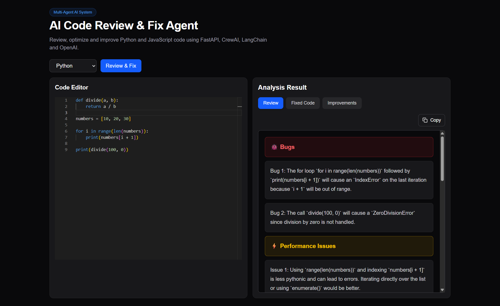
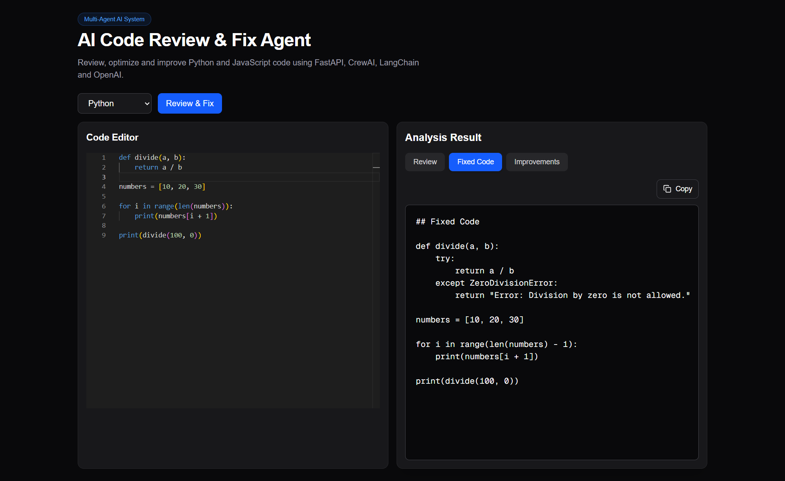
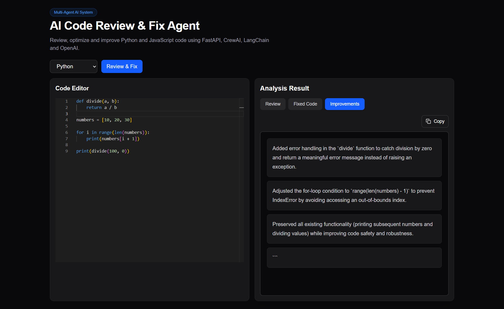

# 🤖 AI Code Review & Fix Agent

An AI-powered Multi-Agent Code Review System that analyzes Python and JavaScript code, detects bugs, suggests improvements, and automatically generates fixed code using FastAPI, CrewAI, LangChain, and OpenAI.

---

## 🚀 Live Demo

### Frontend

https://ai-code-review-agent-iota.vercel.app/

### Backend API

https://ai-code-review-agent-wtj9.onrender.com/

### API Documentation

https://ai-code-review-agent-wtj9.onrender.com/docs

---

## ✨ Features

- ✅ AI Code Review
- ✅ Bug Detection
- ✅ Automatic Code Fixing
- ✅ Performance Suggestions
- ✅ Code Quality Improvements
- ✅ Multi-Agent Architecture
- ✅ FastAPI REST API
- ✅ Responsive Next.js UI
- ✅ OpenAI Integration
- ✅ CrewAI Agent Workflow

---

## 🏗️ Tech Stack

### Frontend

- Next.js
- TypeScript
- Tailwind CSS

### Backend

- FastAPI
- Python
- CrewAI
- LangChain
- OpenAI API

### Deployment

- Vercel (Frontend)
- Render (Backend)

---

## 📸 Screenshots

### 🔍 AI Review Report



---

### 🛠️ Fixed Code Generated By AI



---

### ⚡ Improvement Suggestions



---

## 🔄 Workflow

```text
User Code
    │
    ▼
Frontend (Next.js)
    │
    ▼
FastAPI Backend
    │
    ▼
CrewAI Agents
    │
    ▼
OpenAI Analysis
    │
    ▼
Review + Fix + Improvements
    │
    ▼
Frontend Display
```

---

## 📂 Project Structure

```text
ai-code-review-agent/
│
├── frontend/
│   ├── app/
│   ├── components/
│   ├── hooks/
│   └── lib/
│
├── backend/
│   ├── agents/
│   ├── services/
│   ├── routes/
│   ├── prompts/
│   └── main.py
│
├── screenshots/
│   ├── review.png
│   ├── fixed-code.png
│   └── improvements.png
│
└── README.md
```

---

## 🧪 Example Input

```python
def divide(a, b):
    return a / b

numbers = [10, 20, 30]

for i in range(len(numbers)):
    print(numbers[i + 1])

print(divide(100, 0))
```

---

## 🤖 AI Detects

- IndexError
- ZeroDivisionError
- Performance Issues
- Code Quality Issues

---

## 🔧 AI Generates

- Fixed Code
- Improvement Suggestions
- Detailed Review Report

---

## ⚙️ Installation

### Clone Repository

```bash
git clone https://github.com/hfeezsayed/ai-code-review-agent.git
cd ai-code-review-agent
```

### Backend Setup

```bash
cd backend

python -m venv venv

# Windows
venv\Scripts\activate

pip install -r requirements.txt
```

Create a `.env` file:

```env
OPENAI_API_KEY=your_openai_api_key
```

Run Backend:

```bash
uvicorn main:app --reload
```

---

### Frontend Setup

```bash
cd frontend

npm install

npm run dev
```

---

## 🎯 Future Improvements

- File Upload Support
- GitHub Repository Review
- Multiple Language Support
- Authentication
- Review History
- PDF Report Export
- AI Security Analysis
- Repository-Wide Code Review

---

## 👨‍💻 Author

### Hafeez Ali

GitHub:
https://github.com/hfeezsayed

LinkedIn:
https://www.linkedin.com/in/hafeez-ali-710b89a0/

---

## ⭐ Support

If you found this project useful, please give it a Star ⭐ on GitHub.

It helps others discover the project and motivates future improvements.
